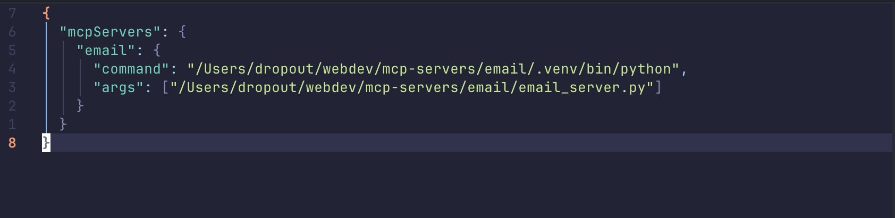
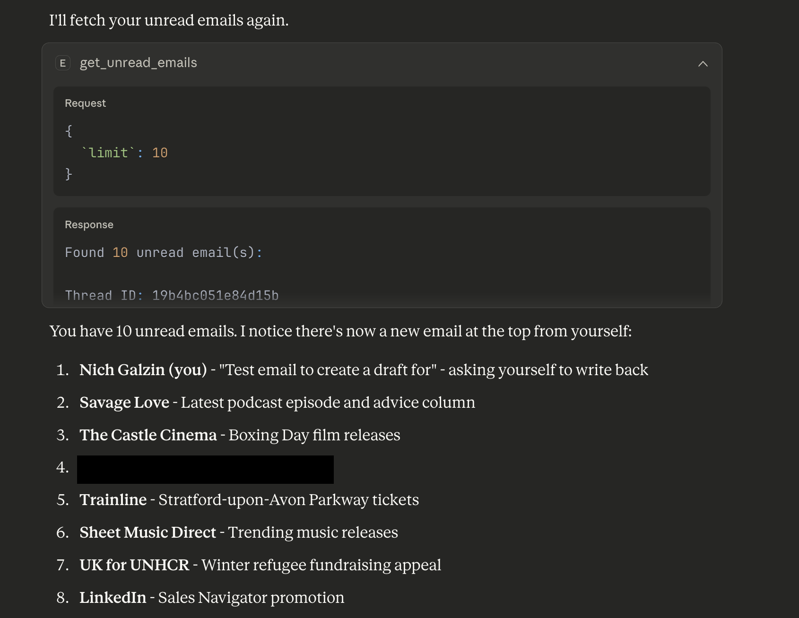
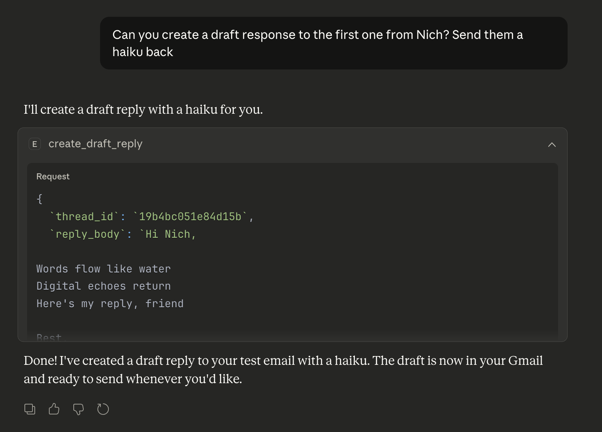

# Gmail MCP Server

A Model Context Protocol (MCP) server that enables AI assistants like Claude to read unread emails from Gmail and create draft replies with proper email threading.

## Features

- **Read Unread Emails**: Fetch unread emails from your Gmail inbox with sender, subject, date, body, and threading information
- **Create Draft Replies**: Generate properly threaded draft replies that appear in the original email conversation
- **OAuth 2.0 Authentication**: Secure Gmail API access using Google's OAuth 2.0 flow
- **Proper Email Threading**: Draft replies maintain conversation context and threading

## Prerequisites

- Python 3.8 or higher
- A Gmail account
- Google Cloud Platform account (free tier works)
- Claude Desktop application

## Quick Start

### 1. Clone and Install

```bash
git clone <your-repo-url>
cd email
pip install -r requirements.txt
```

### 2. Google Cloud Setup

Follow the detailed setup guide in [GMAIL_SETUP.md](GMAIL_SETUP.md) to:

- Create a Google Cloud project
- Enable Gmail API
- Configure OAuth 2.0 credentials
- Download `credentials.json`

### 3. Configure Claude Desktop

Add this configuration to your Claude Desktop config file:

**Location**:

- macOS: `~/Library/Application Support/Claude/claude_desktop_config.json`
- Windows: `%APPDATA%/Claude/claude_desktop_config.json`

```json
{
  "mcpServers": {
    "gmail": {
      "command": "python",
      "args": ["/path/to/your/email/email_server.py"],
      "env": {}
    }
  }
}
```

**Replace `/path/to/your/email/` with the actual path to your project directory.**

Here's what the one for this project looks like:

<div align="center">
  
</div>

### 4. First Run Authentication

The first time you use the server, it will:

1. Open your browser for Gmail authentication
2. Ask for permission to read emails and create drafts
3. Save authentication tokens for future use

## Available Tools

### `get_unread_emails`

Fetches unread emails from your Gmail inbox.

**Parameters:**

- `limit` (optional): Maximum number of emails to fetch (default: 10, max: 50)

**Returns:**

- Thread ID (for creating replies)
- Message ID
- Sender email address
- Subject line
- Date received
- Email body (plain text)

<div align="center">
  
</div>

### `create_draft_reply`

Creates a draft reply to an email thread that appears in Gmail.

**Parameters:**

- `thread_id` (required): Thread ID from `get_unread_emails`
- `reply_body` (required): Your reply message text

**Returns:**

- Draft ID
- Thread ID
- Confirmation message

The draft will appear in Gmail's web interface and mobile app, properly threaded with the original conversation.

<div align="center">
  
</div>

## Example Usage

### Reading Recent Emails

```
"Can you show me my recent unread emails?"
```

Claude will use the `get_unread_emails` tool to fetch and display your unread messages with all relevant information.

### Creating a Reply Draft

```
"Create a polite reply to the email from name@example.com thanking them for their message and asking when we can schedule a call."
```

Claude will:

1. Identify the correct thread ID from the email list
2. Compose an appropriate reply
3. Create a draft using the `create_draft_reply` tool
4. Confirm the draft was created in Gmail

## Security & Privacy

- **Credentials**: All authentication files (`credentials.json`, `token.json`) are excluded from git
- **Scopes**: Uses minimal required Gmail API scopes:
  - `gmail.readonly`: Read emails only
  - `gmail.compose`: Create drafts only (cannot send emails)
- **No Email Storage**: Emails are fetched on-demand, not stored locally
- **OAuth 2.0**: Uses Google's secure OAuth 2.0 flow for authentication

## Project Structure

```
email/
├── email_server.py              # Main server entry point
├── requirements.txt             # Python dependencies
├── GMAIL_SETUP.md              # Detailed Google Cloud setup guide
├── credentials.json            # OAuth credentials (you create this)
├── token.json                  # Auth tokens (auto-created)
└── src/
    └── email_mcp/
        ├── __init__.py         # Package initialization
        ├── server.py          # MCP server setup
        ├── handlers.py        # Tool request handlers
        ├── gmail_auth.py      # OAuth authentication
        └── email_service.py   # Gmail API operations
```

## Troubleshooting

### "Credentials file not found"

- Ensure you've completed the Google Cloud setup in [GMAIL_SETUP.md](GMAIL_SETUP.md)
- Verify `credentials.json` is in the project root directory
- Check that the file isn't empty or corrupted

### "Access blocked: This app's request is invalid"

- Add your Gmail address as a test user in Google Cloud Console
- Ensure both required scopes are enabled in the OAuth consent screen

### Claude Desktop doesn't see the tools

- Verify the path in `claude_desktop_config.json` is absolute and correct
- Restart Claude Desktop after configuration changes
- Check that Python can find all required dependencies

### Authentication browser doesn't open

- Look for a URL in the terminal that you can manually copy/paste
- Ensure no firewall is blocking localhost connections
- Try a different browser if authentication fails
